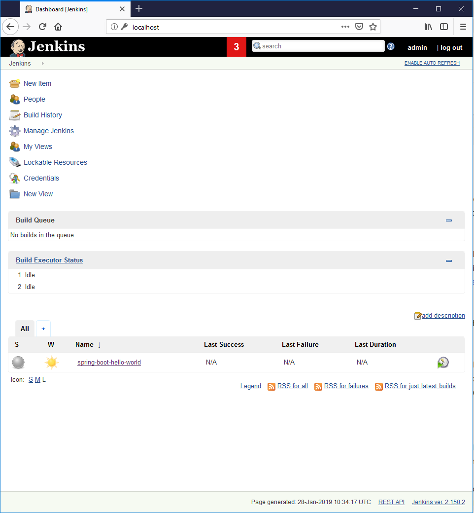

# spring-boot-hello-world-ci
Automated CI setup using Docker

This project creates a basic CI pipeline for the [spring-boot-hello-world](https://github.com/bob-crutchley/spring-boot-hello-world) project 

## Project Components
There are two main components to this project, the NGINX and Jenkins services.

### NGINX
NGINX is a reverse proxy for Jenkins and the deployed application instances.
Both Jenkins and the spring boot servers can be accessed from the same host, just by changing the URL


### Jenkins
Jenkins is the CI tool that is going to be used to facilitate the automation for this project.


## Setup Guide
You will need Docker & Docker Compose installed for this project. 
This guide details how to configure Docker for Linux, if you are on Windows or Mac then you can use the install guide on the
Docker Hub Website and follow the install steps, Docker Compose will be installed this way as well -
[(Windows)](https://hub.docker.com/editions/community/docker-ce-desktop-windows)
[(Mac)](https://hub.docker.com/editions/community/docker-ce-desktop-mac)
.

#### How to install Docker for Linux
```bash
curl https://get.docker.com | sudo bash
```

#### How to install Docker Compose
```bash
sudo curl -L "https://github.com/docker/compose/releases/download/1.23.2/docker-compose-$(uname -s)-$(uname -m)" -o /usr/local/bin/docker-compose
sudo chmod +x /usr/local/bin/docker-compose
```

#### The Pipeline can be created using docker-compose
```bash
docker-compose up -d
```

#### Accessing Jenkins
Jenkins will accessible from port 80 with the credentials set to admin:admin (it's best if you update this of course)



When a branch has been built with the included Jenkins job
It can be accessed from `/spring-boot-hello-world/branch-name`
For example to connect to the deployed master branch:
`/spring-boot-hello-world/master`

